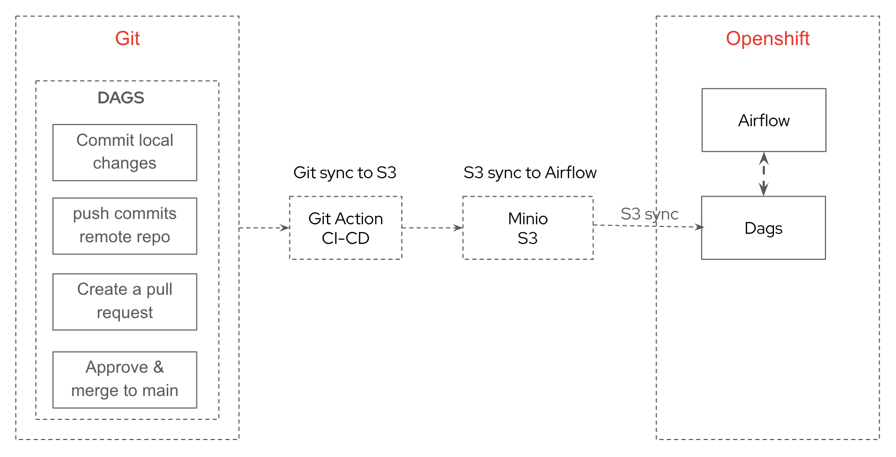

## What is this?

This is a guide for creating data products for the OS-Climate Data Mesh.

## Functionality

The OS-Climate Data Platform is targeting the following capabilities:
- Data-as-Code model for declarative data products
- GitOps-based deployment of data products via automated data pipelines
- Declarative metadata and lineage management
- Data Federation 

Currently, all the data products are deployed as tables accessible via Trino/Hive. In future versions, this will change to Apache Iceberg. Future versions of the platform may support other target databases. 

The architecture of the platform can be seen in the following figure:


The Data Mesh offers a GitOps-based Data-as-Code approach to creating and deploying data products. 

A Data Product is defined in Git Repository. Its structure is described below. 

At runtime, a Data Product can be deployed into the platform either:

* manually
* automatically, using ArgoCD

Once the Data Product is uploaded into the platform, an Airflow pipeline is executed automatically, triggering the ETL pipeline.

## Using the platform

### Who are the primary users 

The primary users of the platform are:
* Data producers who want to create new data products and make them available through the platform;
* Data consumers who want to access datasets for use cases such as for analytics, AI/ML, visualization;

Data producers may create new data products by downloading and transforming already existing datasets (as we will see in the PCAF example below), or from other data products already provided inside the platform. Thus, the data platform acts as a facilitator between data producers and data consumers. 

### A day in the life of a data producer

A data producer will:

* create a data product definition (as described in the `Data-as-Code` section below) in a GitHub repository; 
* develop and test the data pipelines that make up their data product definition on a local version of the platform 
* include additional metadata associated with the data product in the definition
* deploy the contents of the data product onto the platform using the GitOps capabilities 

### A day in the life of a data consumer

A data consumer will:

* use the registered metadata to find data products of interest
* access the tables that make up the data product via Trino

Currently, all the access to data products is available as via Trino. We are planning to add other modes of access in the future, including API-based and data exporting capabilites.

## Data-as-Code Data Product Definitions

OS-Climate Data Products are defined via code, stored in Git. An example of a data product can be found [here](sample_data_products/pcaf).  

In principle, each data product is structured as a collection of Apache Airflow DAGs, performing one or more of the following:

- Downloading data from an external source and loading into an S3-compatible object store or a local database
- Transforming data into a Parquet-compatible format for Apache Hive or Apache Iceberg
- Defining a table structure on top of the Parquet formatted data and registering it in Trino
- Performing transformations on top of Trino tables, either directly in code or using DBT

The product definitions are deployed in Airflow via a central bucket and can be manually executed. The expected result in each case is:

- the data product itself is deployed as one or more Trino tables, which can be queried using the Trino APIs, including Python and Java clients
- the metadata associated with the data product is deployed in the metadata store (OpenMetadata)
- the lineage of the data product is automatically registered in the metadata store (OpenMetadata)

### A data product in detail 

Here's a complete data product [samples](sample_data_products/pcaf) folder:

```

pcaf
├── dbt
│   ├── pcaf
│   │   ├── analyses
│   │   ├── dbt_project.yml
│   │   ├── macros
│   │   ├── models
│   │   │   └── pcaf
│   │   │       ├── countries.py
│   │   │       ├── pcaf_oecd_agg.sql
│   │   │       ├── pcaf_oecd_staging.sql
│   │   │       ├── pcaf_primap.sql
│   │   │       ├── pcaf_primap_staging.sql
│   │   │       ├── pcaf_unfccc_annexi_staging.sql
│   │   │       ├── pcaf_unfccc_nonannexi_staging.sql
│   │   │       ├── pcaf_unfccc_sovereign_emissions.sql
│   │   │       ├── pcaf_unfccc_with_lulucf.sql
│   │   │       ├── pcaf_unfccc_without_lulucf.sql
│   │   │       ├── pcaf_wdi.sql
│   │   │       ├── pcaf_wdi_staging.sql
│   │   │       └── schema.yml
│   │   ├── package-lock.yml
│   │   ├── packages.yml
│   │   ├── seeds
│   │   ├── snapshots
│  └── tests
│   └── profiles.yml
├── generate docs.py
├── pcaf_ingestion-oecd.py
├── pcaf_ingestion-primap.py
├── pcaf_ingestion-unfccc.py
├── pcaf_ingestion-worldbank.py
└── pcaf_unfccc_dbt_transformation.py

```

This data product consists of two sets of files:
* Data pipelines represented as Apache Airflow DAGs (all `pcaf_*.py` files)
* `dbt` transformation definitions; the `dbt` transformations are called by Apache Airflow data pipelines                   

### What can product definitions contain

Product definitions are written as Apache Airflow DAGs in Python. There are several ways to define tasks:

- Very simple tasks that do not require additional dependencies and are not compute intensive can be defined inline as part of the DAG. Possible examples include: downloading small files from external sources, basic conversions, etc
- Complex tasks that do require additional dependencies or are compute intensive can be defined in separate container images and executed using either the DockerOperator (for local deployment) or the KubernetesOperator (when deployed on the platform)
- (Work in progress) In the future, the project will provide predefined containerized images for generic tasks, such as DBT transformations.

### A basic end to end example 

Here is a simple example for a data product definition from the PCAF repository. It describes a process to download and register an intermediate data product as a Trino table. The whole source code is available [here]().

First, we create a task to download the content of the CSV file, transform it into Parquet, and upload it into an S3 bucket that is accessible to Trino.

    @task(
        task_id="load_data_to_s3_bucket"
    )
    def load_data_to_s3_bucket():
        import pandas as pd
        import zipfile
        import urllib.request
        from airflow.providers.amazon.aws.hooks.s3 import S3Hook
        url = "https://api.worldbank.org/v2/country/all/indicator/NY.GDP.MKTP.CD;NY.GDP.MKTP.PP.CD?source=2&downloadformat=csv"
        local_file = "worldbank.zip"
        if os.path.isfile(local_file):
             os.remove(local_file)
        if not os.path.isfile(local_file):
            with urllib.request.urlopen(url) as file:
                with open(local_file, "wb") as new_file:
                    new_file.write(file.read())
                new_file.close()

        zipfile = zipfile.ZipFile(open(local_file, "rb"))

        s3_hook = S3Hook(aws_conn_id='s3')
        for parquet_file_name in zipfile.namelist():
            print(parquet_file_name)
            if "Metadata" not in parquet_file_name:
                with zipfile.open(parquet_file_name, "r") as file_descriptor:
                    df = pd.read_csv(file_descriptor, skiprows=4, quotechar= '"')
                    parquet_bytes = df.to_parquet(compression='gzip')
                    s3_hook.load_bytes(parquet_bytes, bucket_name= "pcaf", key=f"raw/worldbank/worldbank.parquet", replace=True)

Next, we define a task for creating a schema to store our intermediate data product:

    trino_create_schema = TrinoOperator(
        task_id="trino_create_schema",
        trino_conn_id="trino_connection",
        sql=f"CREATE SCHEMA IF NOT EXISTS hive.pcaf WITH (location = 's3a://pcaf/data')",
        handler=list,
    )

Then, we define a task to register this table into Trino:

    trino_create_worldbank_table = TrinoOperator(
        task_id="trino_create_worldbank_table",
        trino_conn_id="trino_connection",
        sql=f"""create table if not exists hive.pcaf.worldbank (
                        "Country Name" varchar,"Country Code" varchar,"Indicator Name" varchar,"Indicator Code" varchar,"1960" double,"1961" double,"1962" double,"1963" double,"1964" double,"1965" double,"1966" double,"1967" double,"1968" double,"1969" double,"1970" double,"1971" double,"1972" double,"1973" double,"1974" double,"1975" double,"1976" double,"1977" double,"1978" double,"1979" double,"1980" double,"1981" double,"1982" double,"1983" double,"1984" double,"1985" double,"1986" double,"1987" double,"1988" double,"1989" double,"1990" double,"1991" double,"1992" double,"1993" double,"1994" double,"1995" double,"1996" double,"1997" double,"1998" double,"1999" double,"2000" double,"2001" double,"2002" double,"2003" double,"2004" double,"2005" double,"2006" double,"2007" double,"2008" double,"2009" double,"2010" double,"2011" double,"2012" double,"2013" double,"2014" double,"2015" double,"2016" double,"2017" double,"2018" double,"2019" double,"2020" double,"2021" double,"2022" double
                        )
                        with (
                         external_location = 's3a://pcaf/raw/worldbank/',
                         format = 'PARQUET'
                        )""",
        handler=list,
        outlets=['hive.pcaf.worldbank']
    )


Finally, we define the end-to-end flow as follows:

    load_data_to_s3_bucket()  >> trino_create_schema >> trino_create_worldbank_table


## GitOps-based data product deployment via automated data pipelines

In order for data products to be accessible to the platform users, the data product definitions (Airflow DAGS , DBT ) created in Git must be deployed onto the platform.

### Data Product Deployment Process using GitAction CI-CD pipeline

### Local Development & Testing

The data product is initially tested in the local development environment to ensure functionality and correctness.

### Code Check-in & PR Creation

Once testing is complete, the product owner checks the code into their respective Git branch.

A Pull Request (PR) is created for code review.

### Code Review & Merge

The PR undergoes a review process.

Upon approval, the product pipeline code—such as Airflow DAGs and DBT models—is merged into the main branch.

### GitHub Actions Trigger & Deployment

Merging the code triggers a GitHub Actions pipeline.

This pipeline pushes all DAGs and DBT code to a MinIO bucket.

The committed code from MinIO is then deployed to Airflow on the target platform.

This process ensures a structured and automated deployment of data pipeline code, maintaining consistency and reliability across environments.




